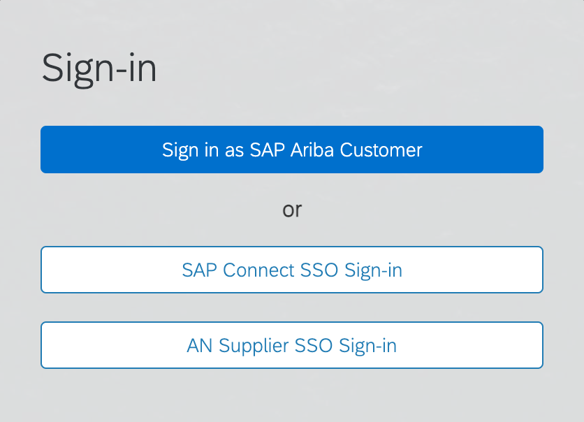
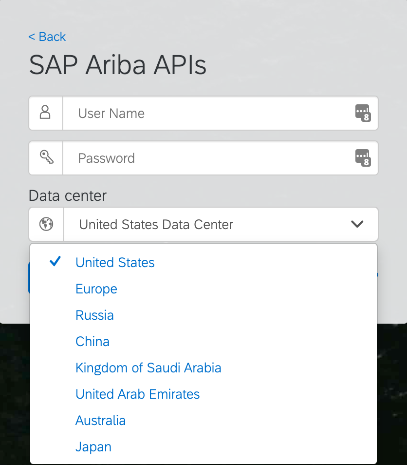
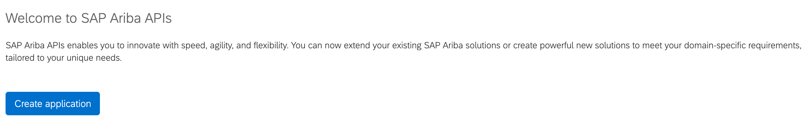
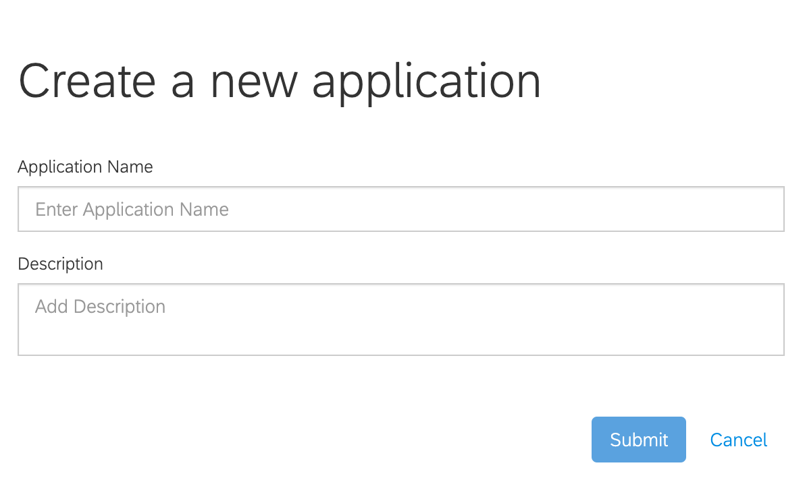
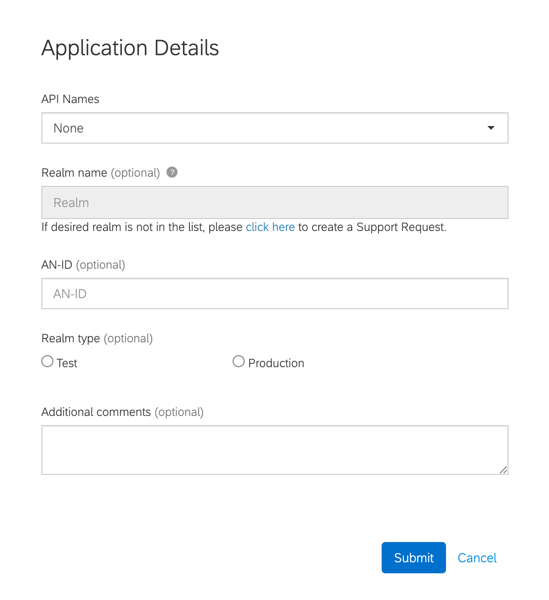

# Request access to an SAP Ariba API

To request access to an SAP Ariba API, we need to follow the steps covered in the SAP Ariba Developer portal documentation: https://help.sap.com/viewer/b61dd8c7e22c4fe489f191f66b4c48d6/cloud/en-US/496d221506e941a894237243ca9ddf2a.html. 

> For a detailed explanation of the SAP Ariba developer portal, creating an application and its approval process, checkout the [SAP Ariba for Developers YouTube playlist :tv:](https://www.youtube.com/watch?v=oXW3SBCadoI&list=PL6RpkC85SLQDXSLHrSPtu8wztzDs8kYPX)

Below, the steps that you need to follow:
- Log in to the SAP Ariba developer portal, e.g. https://developers.ariba.com. The URL will vary depending on the region where your SAP Ariba realm is hosted. 
  > It is possible to select the data center after clicking the `Sign in as SAP Ariba Customer` button.

  |  |  |
  |:--:|:--:|
  
- Once log in, click the `Create application` button from the home page.
  
- Fill out the Create a new application form and hit Submit. Once the application is created, an Application key is generated. This will need to be included in the API requests below.
  
- [Request API access](https://help.sap.com/viewer/b61dd8c7e22c4fe489f191f66b4c48d6/cloud/en-US/f598ae78195d4e839d887c0d003eef01.html) by clicking on `Actions > Request API access`. Select the API you are interested in and the realm (test/production) that the application should have access to. 
  > It is recommended to create separate applications for Test and Production
  

After the API access is approved by SAP Ariba support, the Developer portal administrator will be able to generate the OAuth Secret and Base64 Encoded client and secret required to authenticate against the API.