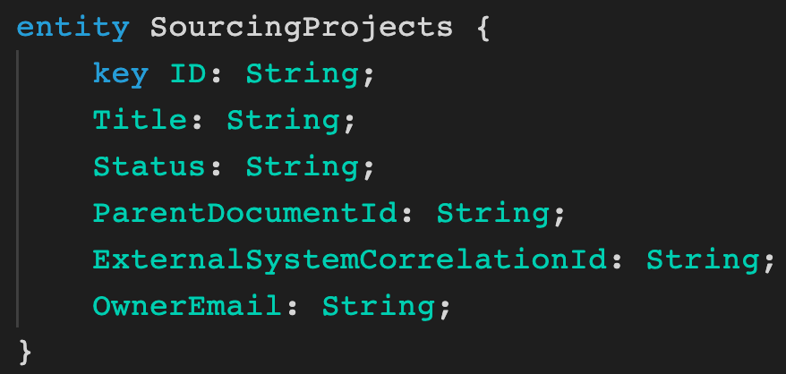
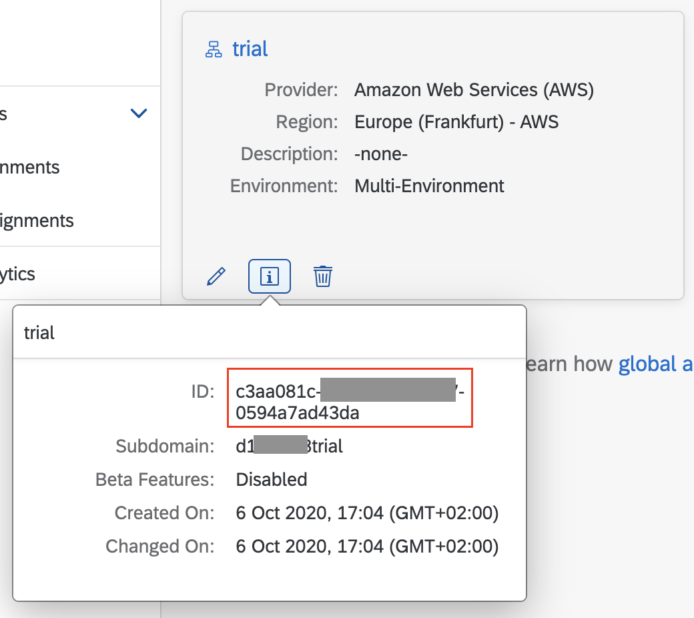
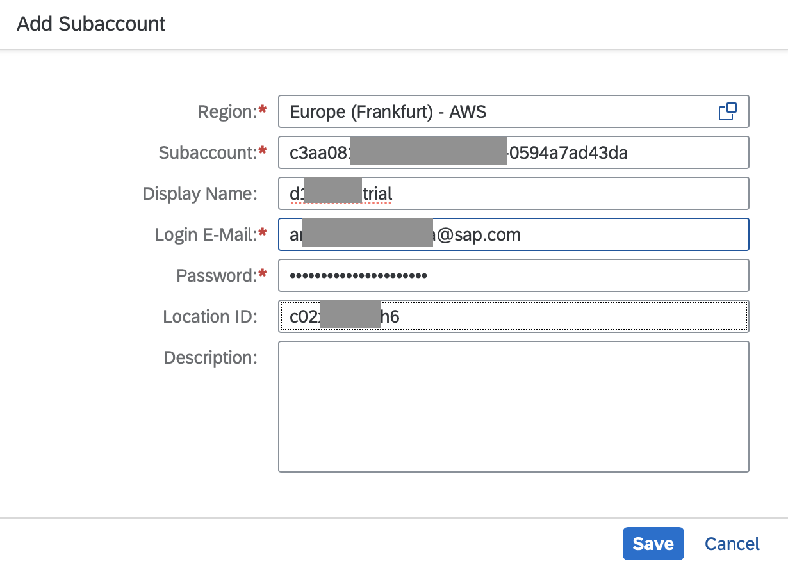
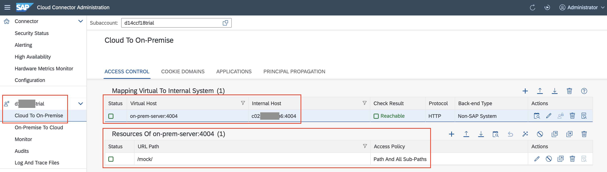
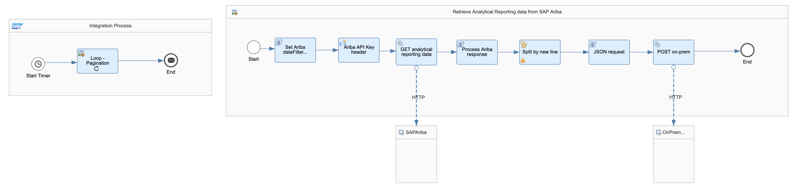
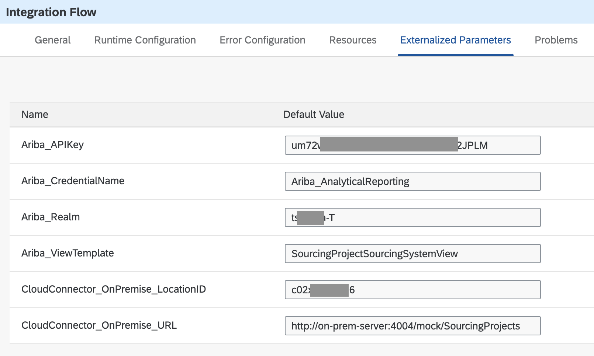
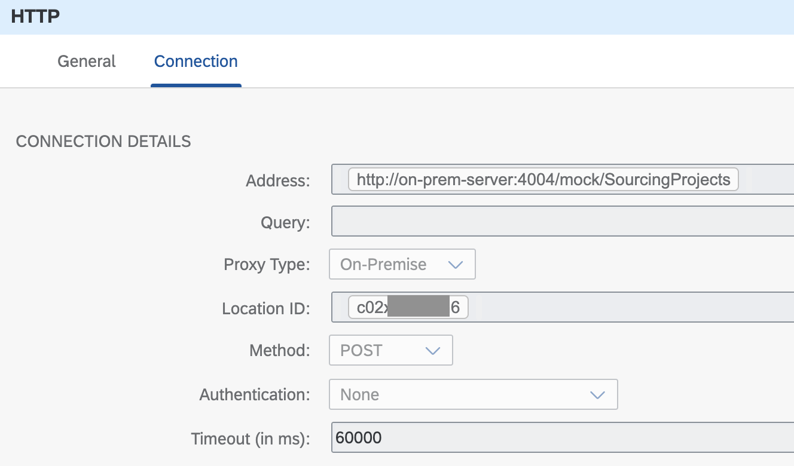
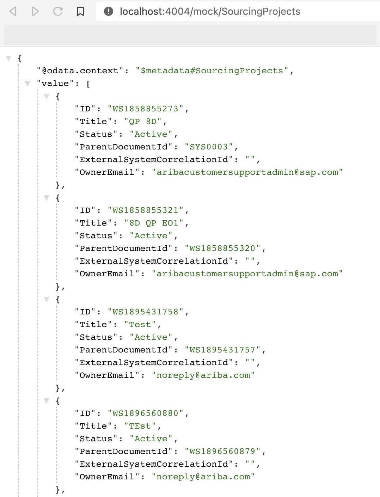

# Replicate SAP Ariba data to an on-premise service using SAP Cloud Integration (SCI) and SAP Cloud Connector (SCC)

In this exercise, we will cover how we can move SAP Ariba data to an on-premise service by using SAP Cloud Integration (SCI) and SAP Cloud Connector (SCC). SAP Cloud Connector will be used to achieve a connection from CPI to the on-premise service. The on-premise service will be hosted in our local machine, which means that we will be installing SCC in our local machine, configuring the connection between SCC and SAP Business Technology Platform (BTP) locally, and granting access to the on-premise service from the local SCC. 

To complete the steps explained in this exercise, there are some prerequisites that we will need to complete first:

- Create application in SAP Ariba Developer Portal and request API access to the Analytical reporting APIs. Unfortunately there is no trial version of SAP Ariba but I guess that if you are reading this exercise, it is because your company uses SAP Ariba :-). To find out how to create an application and request API access in the SAP Ariba Developer Portal check out :point_right: [topics/apis/request-api-access](../../apis/request-api-access/).
    > If you prefer watching videos, you can watch the first two videos available in the SAP Ariba for Developers YouTube playlist ? https://www.youtube.com/playlist?list=PL6RpkC85SLQDXSLHrSPtu8wztzDs8kYPX.

- An SAP BTP trial account. Make sure to enable to a subscription to the Integration Suite (Go to your trial subaccount > Subscriptions > Integration Suite). Once in the Integration Suite application, add the
Design, Develop and Operate Integration Scenarios (SAP Cloud Integration).
    > To find out how to create a trial account: https://developers.sap.com/tutorials/hcp-create-trial-account.html

- Download and install SAP Cloud Connector (SCC) locally. We will be connecting it to SAP BTP so that SCI can communicate with the mock on-premise service. 
    > To find out how to install SCC, follow this tutorial - https://developers.sap.com/tutorials/cp-connectivity-install-cloud-connector.html or the SAP Help documentation: https://help.sap.com/viewer/cca91383641e40ffbe03bdc78f00f681/latest/en-US/57ae3d62f63440f7952e57bfcef948d3.html 
  
- Clone this repository as we will be running the on-prem-service locally and configuring its access in SCC. This is to simulate an on-premise service.

### On-premise service

The on-premise service that the integration will be communicating with is a simple Cloud Application Programming (CAP) model application hosted locally. It exposes a mock service to which we can post the `SourcingProjectSourcingSystemView` data extracted from the SAP Ariba Analytical reporting API. 

|  |
|:--:|
| On-premise service schema |

> The code of the on-premise service will be released shortly. Stay tuned.

Now that we have access to the different systems and we've installed the required software, we will proceed to explain how to get SAP Cloud Integration talking with SAP Ariba and the on-premise service.

## Step 1 - Configure SAP Cloud Connector locally

⚡ Configure the required components in SAP Cloud Connector locally.

Once SCC is installed locally and running, go to http://localhost:8443 to configure the connection to SAP BTP. The default login details are:
- User Name: `Administrator`
- Password: `manage`

Once in the Cloud Connector UI, we need to set up the secure tunnel between our on-premise system (our local machine) and SAP BTP (Cloud Foundry environment).
> The steps describe below are based on the `Set up Secure Tunnel between ABAP System and SAP BTP (CF)` tutorial - https://developers.sap.com/tutorials/cp-connectivity-create-secure-tunnel.html.

1. Go to the SAP BTP trial and check the details of your trial subaccount. Copy the ID as we will be using this for our configuration in SCC.
   |  |
   |:--:|
   | Subaccount ID in SCP |
2. In SCC, click on the Add Subaccount button and fill the fields in the form:
   |  |
   |:--:|
   | Create Subaccount |
3. Once configured the subaccount, proceed to create the Cloud to On-Premise connection. Here you define the name of the virtual host and map it to the internal host. After mapping the virtual to internal system, define the resource that you want to expose. In the case of the on-premise service, we want the cloud to be able to send message to anything under the `/mock/` URL path. 
   |  |
   |:--:|
   | Cloud to On-premise connection |

Our SCC instance is fully configured, we can now proceed to creating the SAP CPI integration flow.

## Step 2 – Create and set up integration flow in SAP Cloud Integration

|  |
|:--:|
| Integration flow |

⚡ Create an integration flow in SAP Cloud Integration following the guidelines below.

Given that it is possible to receive large amounts of data from the SAP Ariba Analytical Reporting APIs, there might be a need to paginate the response. This is taken in consideration in the integration flow, hence why there is a looping process in it.

> To understand how pagination works in the SAP Ariba APIs, check out the explanation in [topics/apis/data-pagination](../../apis/data-pagination/).

We can use externalized parameters below to ensure that the integration flow is reusable.

|  |
|:--:|
| Externalized parameters |

### Integration Process
The integration flow includes an integration process that can start on a schedule and a looping process call to handle the SAP Ariba response pagination. The loop will stop when the header pageToken value is STOP. This is handled by the script responsible of processing the SAP Ariba API response.

|  |
|:--:|
| Looping process conditions |

Retrieve Analytical Reporting data from SAP Ariba (Local integration process)
This local integration process retrieves the analytical data from SAP Ariba and sending it to an on-premise service. In this exercise we will be extracting data from the `SourcingProjectSourcingSystemView` view template. Below, the details on what each block in the process is doing:

- *Set Ariba dateFilter parameter (JS script)*: Specify the date filter expected when calling the view template. The dateFilter included in the script below has been hardcoded for simplicity purposes. In a production scenario this can be dynamically set based on your reporting needs and how often the integration flow will run. See [set-date-filter.js](set-date-filter.js)
- *Ariba API Key header*: Creates the ‘apiKey’ header which is required when calling the SAP Ariba APIs. It sets the value specified for the `{{Ariba_APIKey}}` external parameter.
- GET analytical reporting data (HTTP to SAP Ariba)
- *Process SAP Ariba response (JS script)*: This script checks for the PageToken value in the API response and handles its value. This will be used to indicate if the looping process should continue or finish. It also prepares the JSON payload that the on-premise service expects. The contents of the file expects a JSON structure per line and every line will be the equivalent of a record in the on-premise service. See [process-ariba-response.js](process-ariba-response.js)
- General Splitter: The expression type is Line Break and its purpose is to process each JSON payload separately.
    ```json
    {"ID": "WS1858855273","Title": "QP 8D","Status": "Active","ParentDocumentId": "SYS0003","ExternalSystemCorrelationId": "","OwnerEmail": "aribacustomersupportadmin@sap.com"}
    ```
- Set first line as body (JS script): The splitter will output a body like the one above. The script will just set the JSON payload, 2nd line, as the body. See [first-line-as-body.js](first-line-as-body.js)

- *POST on-prem (HTTP to On-premise service)*: The address field value is set from the {{OnPremise_URL}} external parameter.

    |  |
    |:--:|
    | On-premise HTTP adapter configuration |

Now that all steps are completed, we deploy the integration flow and check the records are created in the on-premise service.

|  |
|:--:|
| On-premise data |

As we can see, we have replicated the SAP Ariba data to our on-premise service. We were able to communicate from SAP BTP to our on-premise service securely by using SAP Cloud Connector.

