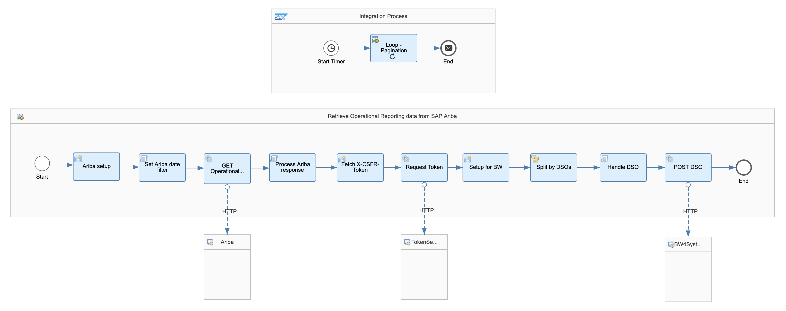
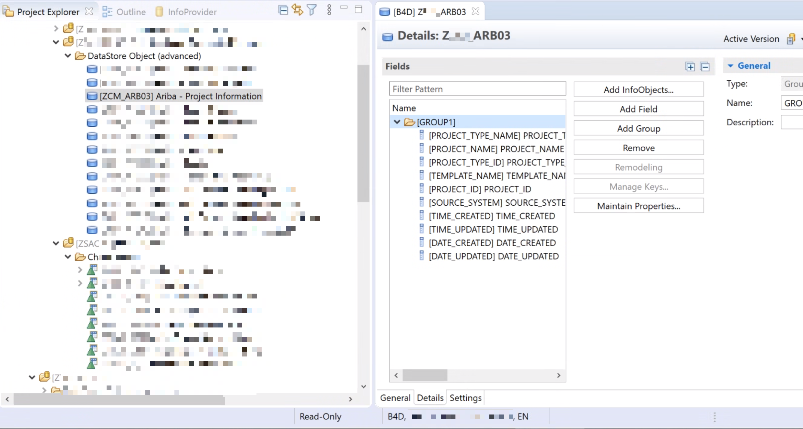
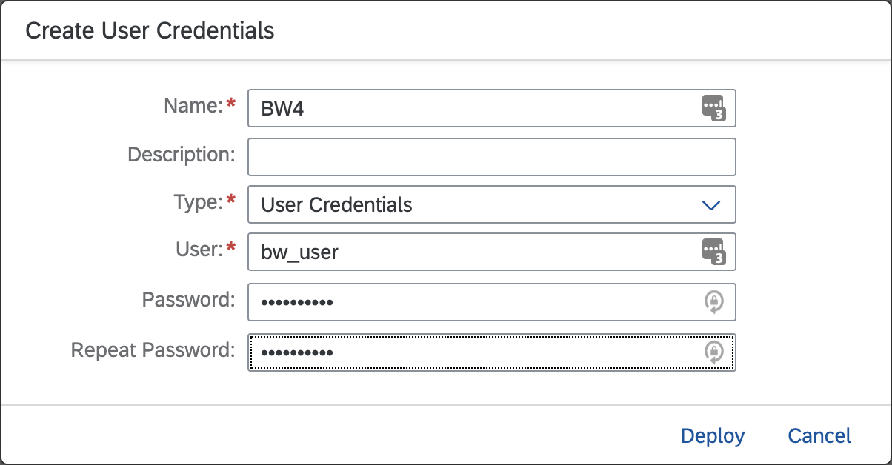
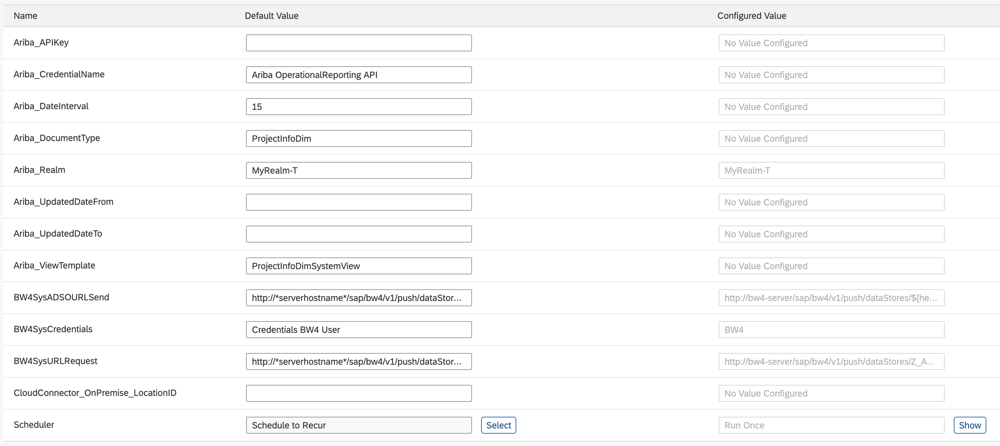
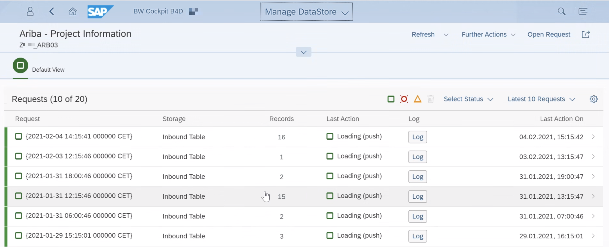

# Replicate SAP Ariba operational data to SAP BW/4HANA 2.0

*Here we will cover how we can move operational reporting data available in the SAP Ariba APIs to SAP BW/4HANA 2.0. To achieve this, we will use the trial version of the Integration Suite available in SAP BTP. We will build an integration flow in SAP Cloud Integration, transform the data using a Groovy script and send the data to BW/4HANA using the REST data load functionality.*

In a [previous exercise](../cpi-open-connectors/README.md), I covered how to use SAP Cloud Integration to replicate SAP Ariba analytical data. This exercise is a continuation of it but will focus just on what is required to get it working with SAP BW/4HANA 2.0.

There are blog posts in SAP Community, e.g. [SAP Cloud Platform Integration (CPI) to push data into SAP BW/4HANA](https://blogs.sap.com/2019/08/23/sap-cloud-platform-integration-cpi-to-push-data-into-sap-bw4hana/comment-page-1) and [PI REST Adapter: Connect to BW/4HANA using X-CSRF-Token](https://blogs.sap.com/2019/09/05/pi-rest-adapter-connect-to-bw4hana-using-x-csrf-token/), that cover the details of the how the REST based interface in SAP BW/4HANA 2.0 can be used to push data. I will briefly touch on the objects in SAP BW/4HANA, to get the full details please refer to the blog posts previously mentioned.

To complete the steps explained in this exercise, there are some prerequisites that we will need to complete first:

- Check the prerequisites listed in the [previous exercise](../cpi-open-connectors/README.md).
- Access to SAP BW/4HANA. I guess that if you are reading this, it is because your company uses SAP BW/4HANA and have access to an instance :-)

In this instance we will "combine" the integration flow developed in previous exercises and the [SAP BW/4HANA Integration With Rest Based Data Load](https://api.sap.com/package/SAPBW4HANAIntegrationWithRestBasedDataLoad?section=Overview) integration package available in the SAP API Business Hub. There are some differences in this integration with what is available in the integration package:
1. We will not be using message mapping to map data to the BW structure. As the groovy script will be responsible of doing the transformation.
2. The integration flow here can send data to multiple DSOs (Data Store Objects) in BW. The integration package only allows sending data to one DSO.
3. We will be posting a JSON message (yes, JSON not XML) to BW.


Now that we have access to the different systems, and we know the main differences between the integration flows, we will proceed to explain how to get SAP Cloud Integration talking with SAP Ariba and SAP BW/4HANA.
1. Set up the Data Store Object in SAP BW/4HANA 2.0
1. Deploy security material in SAP Cloud Integration - SAP BW/4HANA credentials
1. Update the integration flow components
   1. Modify Process Ariba response script
1. Deploy the integration flow

|  |
|:--:|
| Fig. 1 – Integration flow to SAP BW/4HANA |

## Step 1 – Set up the Data Store Object in SAP BW/4HANA 2.0

In this exercise, we will be sending project information that is available in the SAP Ariba Operational Reporting API. The project information is available via the ProjectInfoDimSystemView, which exposes the ProjectInfoDim document type. The Data Store Object (DSO) in SAP BW/4HANA has the definition below.

|  |
|:--:|
| Fig. 2 – Data Store Object definition |

## Step 2 – Deploy security material in SAP Cloud Integration

⚡ Go to your SAP Cloud Integration instance and create/deploy a security material (Monitor > Manage Security > Security Material). This will be used by the integration flow to communicate with SAP BW/4HANA.

|  |
|:--:|
| Fig. 3 – Security material |


## Step 3 – Update the integration flow components
 
⚡ Remove the modify content and Set Authorization components. Add a General Splitter and copy the components available in the [SAP BW/4HANA Integration With Rest Based Data Load](https://api.sap.com/package/SAPBW4HANAIntegrationWithRestBasedDataLoad?section=Overview) integration package to communicate with SAP BW/4HANA.

The integration flow should look like the integration flow in Fig. 1. Below, the details on what each of the new components are doing:

- Ariba setup: Headers (updatedDateFrom, updatedDateTo, dateInterval, apiKey) are set from the externalised parameters. 
- Modify the Process Ariba response script: In the previous exercise, we were using a Javascript script. Here, we are replacing it for a Groovy script and instead of outputting JSON lines, the script will be outputting the DSOs that the script processes. See [OperationalReportingBW.groovy](OperationalReportingBW.groovy).

    ```
    DSO
    Z_ARB01
    Z_ARB02
    ```

- Setup for BW: Sets the message headers Accept and Content-Type to `application/json`. This is to inform BW that it will receive a JSON payload. Also, we set the `${property.payload}` as the Message Body. This is the payload that was produced by the `processAribaResponse` method. 
- Split by DSOs: The expression type is Line Break and its purpose is to process each DSO separately. In the `Process Ariba Response` script, we define the DSOs that we are processing. This is so we can then set as a body the actual DSO specific payload transformed in the script.
- Handle DSO: It calls the `exchangeDSOPropertyAndBody` method and it will use the contents of the body, e.g. Z_ARB01 - our DSO name, and set the DSO-specific payload as the body, which is stored as a property of the exchange.
- HTTP connections to TokenService and BW4System: Configure the connections to the SAP BW/4HANA instance. It is likely that the SAP BW/4HANA system is on-premise and SAP Cloud Connector can be used to connect to it. To find out more on how to connect from SAP Cloud Integration to an on-premise system, check this out - [cpi-open-connectors](../cpi-open-connectors/).

### Externalised parameters

The externalised parameters in the figure below have been exposed to make the integration flow more flexible. This enables using the same integration flow to extract different view templates from the Operational Reporting API. All that is required to handle a new view template, is specifying a transformation for the document type in the [Groovy script](OperationalReportingBW.groovy).

|  |
|:--:|
| Fig. 4 – Integration flow externalised parameters |

## Step 4 - Deploy integration flow

Now that all steps are completed, we deploy the integration flow and check the DSO loads and records created in SAP BW/4HANA 2.0.

|  |
|:--:|
| Fig. 5 – DSO Load |

|  |
|:--:|
| Fig. 6 – Table contents in SAP BW/4HANA |

As we can see, we have replicated the SAP Ariba data to SAP BW/4HANA 2.0. We can now use this dataset to create a report/dashboard in reporting tools that connect to SAP BW/4HANA, e.g. SAP Analytics Cloud. 

### Food for thought
- In the SAP Ariba Operational Reporting view template you can define multiple filters. How can the integration flow be updated to handle create and updated dates?
- How can we make a call to SAP BW/4HANA only when there is data available?
- What can we do to store the payload sent to SAP BW/4HANA in a DataStore for future reference?
