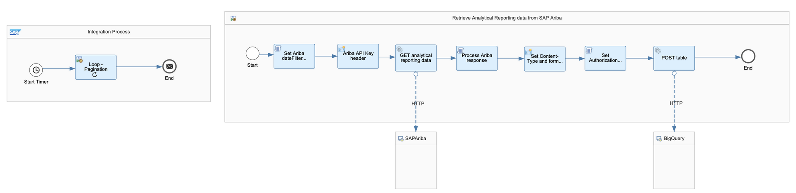
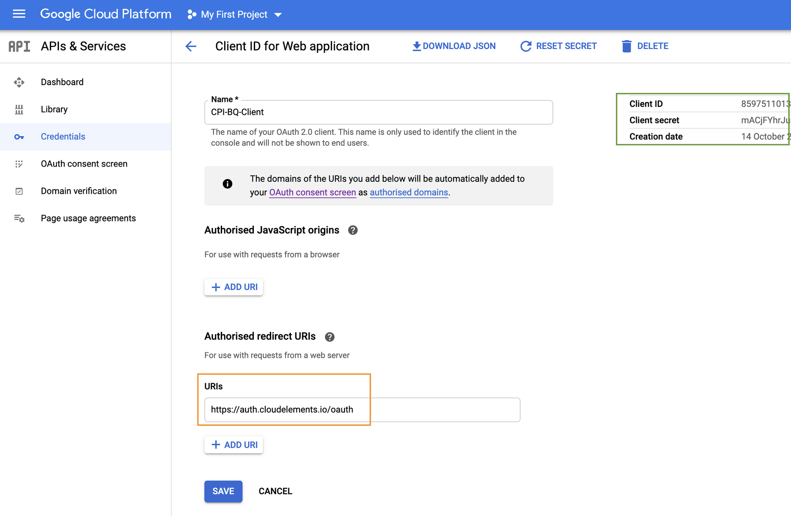
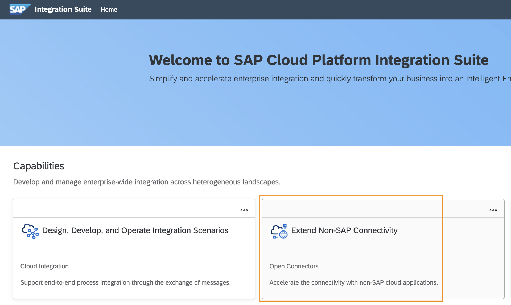
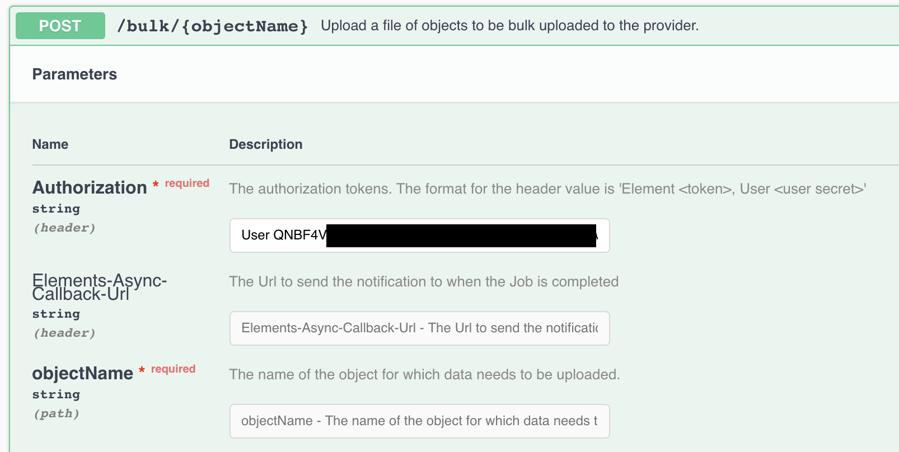
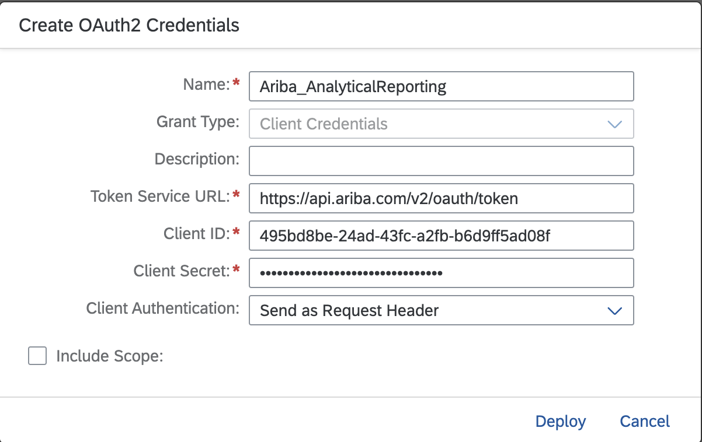
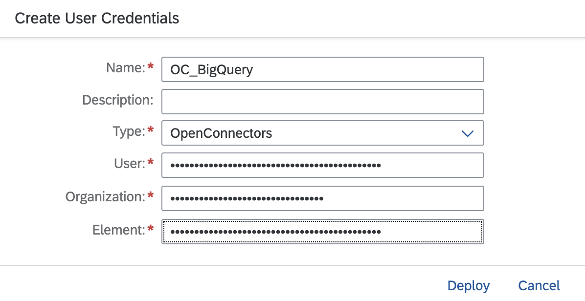
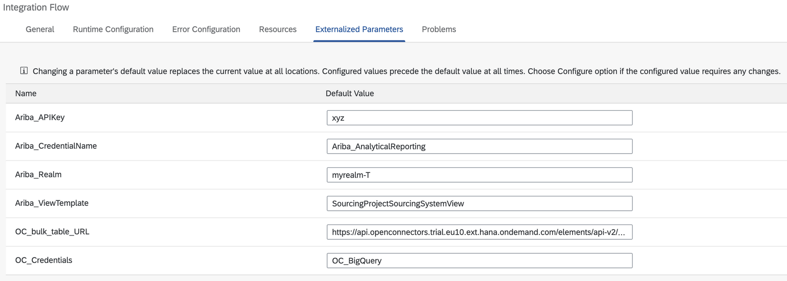
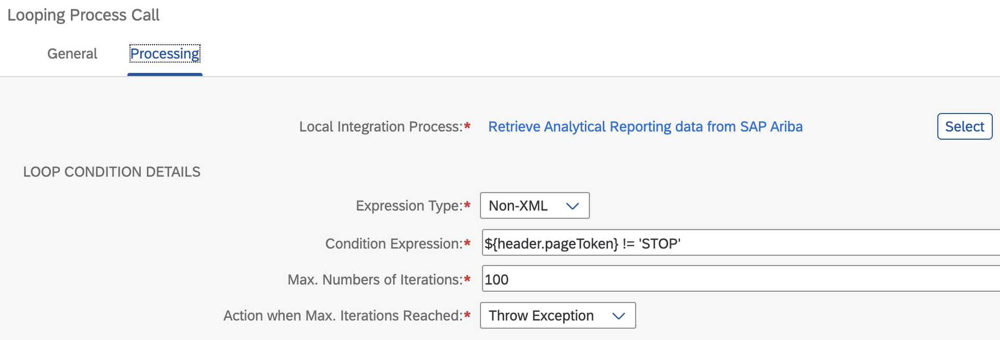
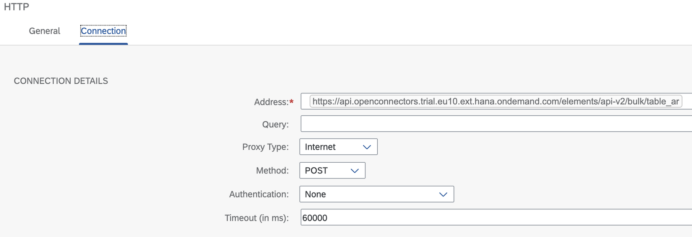

# Replicate SAP Ariba analytical data using SAP Cloud Integration and Open Connectors

> This content was first published as a blog post - https://blogs.sap.com/2020/10/18/replicate-sap-ariba-analytical-data-to-big-query-using-sap-cloud-platform-integration/ 

In this exercise, we will cover how we can move analytical data available in the SAP Ariba APIs to Big Query. To achieve this, we will use the trial version of the Integration Suite available in SAP BTP. We will build an integration flow in SAP Cloud Integration and configure an Open Connector instance to send data to Big Query.

To complete the steps explained in this exercise, there are some prerequisites that we will need to complete first:

- Create application in SAP Ariba Developer Portal and request API access to the Analytical reporting APIs. Unfortunately there is no trial version of SAP Ariba but I guess that if you are reading here, it is because your company uses SAP Ariba :-). To find out how to create an application and request API access in the SAP Ariba Developer Portal check out :point_right: [topics/apis/request-api-access](../../apis/request-api-access/).
    > If you prefer watching videos, you can watch the first two videos available in the SAP Ariba for Developers YouTube playlist ? https://www.youtube.com/playlist?list=PL6RpkC85SLQDXSLHrSPtu8wztzDs8kYPX.

- An SAP BTP trial account. Make sure to enable to a subscription to the Integration Suite (Go to your trial subaccount > Subscriptions > Integration Suite). Once in the Integration Suite application, add the
Design, Develop and Operate Integration Scenarios (SAP Cloud Integration) and Extend Non-SAP Connectivity (Open Connectors) capabilities.
    > To find out how to create a trial account: https://developers.sap.com/tutorials/hcp-create-trial-account.html

- Access to BigQuery. Google Cloud Platform offers a free trial, through which you can use Big Query. Go ahead and create a trial account if you don’t have access to Google Cloud Platform – https://cloud.google.com/free/.

Now that we have access to the different systems, we will proceed to explain how to get SAP Cloud Integration talking with SAP Ariba and Big Query.

We will build an integration flow in SAP Cloud Integration whose goal is to extract analytical data from SAP Ariba and send the data to BigQuery. To accomplish this we will do the following:

1. Create an OAuth application in Google Cloud Platform -> BigQuery
2. Set up a BigQuery instance in Open Connectors
3. Deploy security material in SAP Cloud Integration
4. Create integration flow in SAP Cloud Integration

|  |
|:--:|
| *Fig. 1 – Integration flow* |

## Step 1 – Create an OAuth 2.0 application in Google Cloud Platform
 
⚡ Navigate to the Google Cloud Platform console and create an OAuth 2.0 client.

In Google Cloud Platform, select the project and go to API & Services > Credentials. Create a credential for OAuth Client ID and select Web application as the application type. Make sure to add https://auth.cloudelements.io/oauth as an Authorised redirect URI. Once the client is created, copy the Client ID and Client secret as we will need them to configure an instance of BigQuery in Open Connectors.

|  |
|:--:|
| *Fig. 2 – Google Cloud Platform OAuth credentials* |

## Step 2 – Set up a BigQuery instance in Open Connectors
⚡ Access the Open Connectors UI, from within the SAP Integration Suite, and create an instance of the BigQuery connector. Once created, copy the Authorization header details displayed in the API docs.

|  |
|:--:|
| Fig. 3 – Integration Suite UI |

In Open Connectors, go to Connectors and search for BigQuery and select Authenticate. It will open the configuration screen to create a new instance. Enter the required information and complete the authorization flow to grant Open Connectors access to BigQuery.

|  |
|:--:|
| Fig. 4 – BigQuery connector configuration |

Once the authentication is complete, visit the API docs of the connector instance just created (Instances > Your connector > API Docs). In the API docs, select any method and copy the value included as an Authorization header, e.g. User QNBF4V=, Organization a0f234e, Element d3jbWv5/xxx/yyyyyyy/zzzzxqrk=. We will use this value to configure the Open Connector credentials in the next step.

|  |
|:--:|
| Fig. 5 – Open Connector API docs |

## Step 3 – Deploy security material in SAP Cloud Integration
⚡ Go to your SAP Cloud Integration instance and create/deploy 2 security materials (Monitor > Manage Security > Security Material). This will be used by the integration flow to communicate with SAP Ariba and BigQuery.

| Name | Type | Fields |
|--|--|--|
| Ariba_AnalyticalReporting | OAuth2 Client credentials | Enter the Token service URL, Client ID and Client Secret |
| OC_BigQuery | User credentials (Open Connectors) | Enter the User, Organization, and Element details from Open Connectors |

|   |
|:--:|
| Fig. 6 – Security material |

## Step 4 – Create and set up integration flow in SAP Cloud Integration

⚡ Create an integration flow in SAP Cloud Integration following the guidelines below.

Given that it is possible to receive large amounts of data from the SAP Ariba Analytical Reporting APIs, there might be a need to paginate the response. This is taken in consideration in the integration flow, hence why there is a looping process in it.

> To understand how pagination works in the SAP Ariba APIs, check out the explanation in [topics/apis/data-pagination](../../apis/data-pagination/).

We can use externalized parameters below to ensure that the integration flow is reusable.

|  |
|:--:|
| Fig. 7 – Externalized parameters |

⚠️ When developing the integration flow you can face an issue when posting the payload to BigQuery (Open Connector). Given that we will be creating multiple records in a single request, we need to post the file as a . When posting the file, we was always getting the error below. If we follow [Matti Leydecker advice](https://blogs.sap.com/2019/11/14/what-is-form-data-and-how-to-send-it-from-sap-cloud-platform-integration-cpi/) to replace the \n with \r\n, but still was unable to successfully post the message using the Open Connectors adapter. Hence why we end up using the HTTP adapter and constructing/cleaning the payload (Set Content-Type and form-data elements content modifier) in the integration flow.

```
com.sap.it.rt.adapter.openconnectors.exceptions.OpenConnectorsException: Error occured in Http Request :
com.sap.it.rt.adapter.openconnectors.exceptions.OpenConnectorsException: Invalid Multipart Formdata Payload, cause: 
com.sap.it.rt.adapter.openconnectors.exceptions.OpenConnectorsException: Invalid Multipart Formdata Payload
```
 

### Integration Process
The integration flow includes an integration process that can start on a schedule and a looping process call to handle the SAP Ariba response pagination. The loop will stop when the header pageToken value is STOP. This is handled by the script responsible of processing the SAP Ariba API response.

|  |
|:--:|
| Fig. 8 – Looping process conditions |

Retrieve Analytical Reporting data from SAP Ariba (Local integration process)
This local integration process retrieves the analytical data from SAP Ariba and sending it to BigQuery. Below, the details on what each block in the process is doing:

- *Set Ariba dateFilter parameter (JS script)*: Specify the date filter expected when calling the view template. The dateFilter included in the script below has been hardcoded for simplicity purposes. In a production scenario this can be dynamically set based on your reporting needs and how often the integration flow will run. See [set-date-filter.js](set-date-filter.js)
- *Ariba API Key header*: Creates the ‘apiKey’ header which is required when calling the SAP Ariba APIs. It sets the value specified for the `{{Ariba_APIKey}}` external parameter.
- GET analytical reporting data (HTTP to SAP Ariba)
- *Process SAP Ariba response (JS script)*: This script checks for the PageToken value in the API response and handles its value. This will be used to indicate if the looping process should continue or finish. It also prepares the file that the Open Connector BigQuery instances expects. The contents of the file expects a JSON structure per line and every line will be the equivalent of a record in BigQuery. See [process-ariba-response.js](process-ariba-response.js)
- *Set Content-Type and form-data elements*: As mentioned before, here is where we set the Content-Type and payload.
  - Message Header: Set Content-Type to “multipart/form-data; boundary=—-WebKitFormBoundary7MA4YWxkTrZu0gW”. The same boundary is specified in the message body.
  - Message Body: Set type to Expression and the payload below as Body.
    ```
    ------WebKitFormBoundary7MA4YWxkTrZu0gW
    Content-Disposition: form-data; name="file"; filename="payload.json"
    Content-Type: application/json

    ${body}

    ------WebKitFormBoundary7MA4YWxkTrZu0gW--
    ```
- *Set Authorization and cleaning payload (Groovy script)*: Given the problems faced when using the Open Connector adapter, we end up retrieving the Open Connector credentials from the SecureStoreService and setting the Authorization header. Also, end up cleaning the payload as suggested by Matti Leydecker. See [authorisation-and-cleaning.groovy](authorisation-and-cleaning.groovy)
- *POST table (HTTP to BigQuery)*: The address field value is set from the {{OC_bulk_table_URL}} external parameter.

    |  |
    |:--:|
    | Fig. 9 – BigQuery HTTP adapter configuration |

Now that all steps are completed, we deploy the integration flow and check the records created in BigQuery.

|  |
|:--:|
| Fig. 10 – BigQuery table data |

As we can see, we have replicated the SAP Ariba data to BigQuery. We can now use this dataset to create a report/dashboard in reporting tools that connect to BigQuery.

You’ve made it to the end of the exercise 👏👏. We’ve covered how we can retrieve data from the SAP Ariba APIs and implement pagination in SAP Cloud Integration, by using the looping process call. Also, how we can leverage Open Connectors to communicate with external services, e.g. BigQuery. Finally, an integration flow that can handle the end-to-end process of extracting the data and sending it to BigQuery.