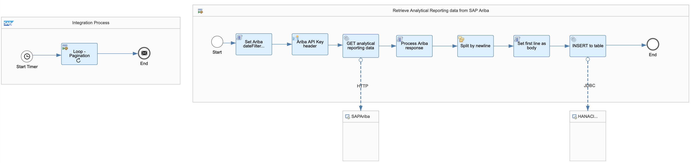
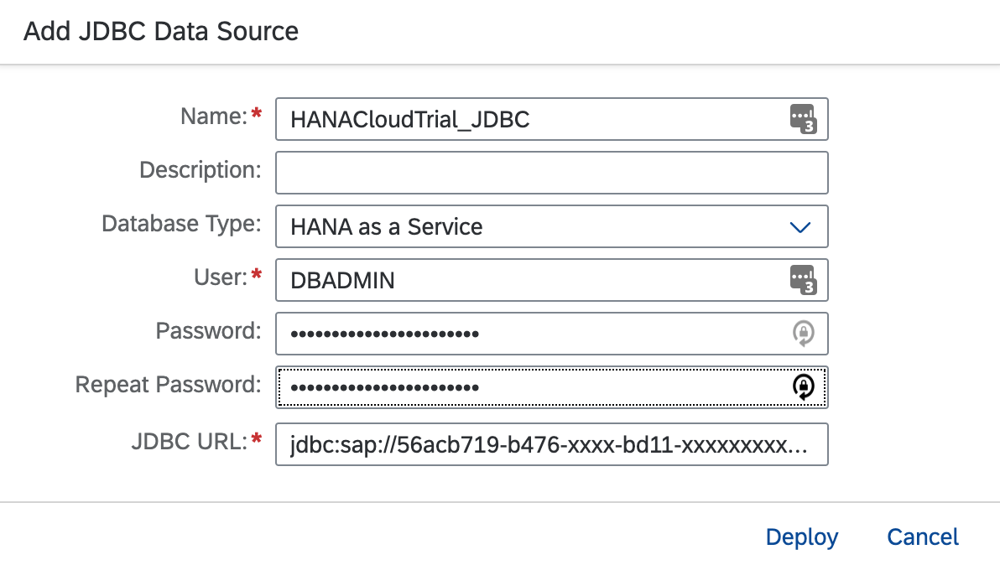
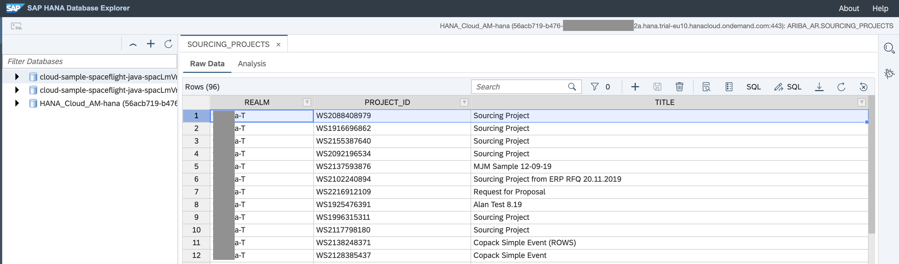

# Replicate SAP Ariba analytical data to SAP HANA Cloud

> This content was first published as a blog post - https://blogs.sap.com/2020/11/03/how-to-replicate-sap-ariba-analytical-data-to-sap-hana-cloud/

Here we will cover how we can move analytical data available in the SAP Ariba APIs to SAP HANA Cloud. To achieve this, we will use the trial version of the Integration Suite and SAP HANA Cloud available in SAP Cloud Platform. We will build an integration flow in SAP Cloud Platform Integration and use the recently [released JDBC adapter](https://help.sap.com/doc/43b304f99a8145809c78f292bfc0bc58/Cloud/en-US/98bf747111574187a7c76f8ced51cfeb.html?sel1=Cloud%20Integration&sel4=Cloud%20Foundry&sel3=New) for SAP Cloud Platform Integration (Cloud Foundry environment) to send data to SAP HANA Cloud.

In a [previous exercise](../cpi-open-connectors/README.md), I covered how to use SAP Cloud Platform Integration to replicate SAP Ariba analytical data. This exercise is a continuation of it but will focus just on what is required to get it working with SAP HANA Cloud.

To complete the steps explained in this exercise, there are some prerequisites that we will need to complete first:

- Check the prerequisites listed in the [previous exercise](../cpi-open-connectors/README.md).
- Access to SAP HANA Cloud. To learn how to create a HANA Cloud trial account, checkout this video created by Thomas Jung: https://www.youtube.com/watch?v=Wyi5EweH29I.

Now that we have access to the different systems, we will proceed to explain what we need in to get the SAP Cloud Platform Integration integration flow to SAP HANA Cloud.

1. Deploy JDBC security material in SAP Cloud Platform Integration
2. Update the integration flow components
   1. Modify Process Ariba response script
3. Deploy the integration flow



Fig. 1 – Integration flow to SAP HANA Cloud

## Step 1 – Deploy JDBC material in SAP Cloud Platform Integration

⚡ Go to your SAP Cloud Platform Integration instance and create/deploy 2 security materials (Monitor > Manage Security > JDBC Material). This will be used by the integration flow to communicate with SAP HANA Cloud.



Fig. 2 – JDBC material

Above we are using DBADMIN for simplicity purposes, this is not recommended for production. Sample JDBC URL: jdbc:sap://56acb719-b476-xxxx-bd11-xxxxxxxxx.hana.trial-eu10.hanacloud.ondemand.com:443/?encrypt=true. Note that the URL will vary depending on the region of your account and the port in the connection string is 443.

## Step 2 – Update the integration flow components
 
⚡ Remove the modify content and Set Authorization components. Add a General Splitter and Javascript script components after the Process Ariba response script.

The integration flow should look like the integration flow in Fig. 1. Below, the details on what each of the new components are doing:

- Modify the Process Ariba response script: Instead of outputting JSON lines, the script will not be outputting INSERT SQL statements. See [process-ariba-response.js](process-ariba-response.js).

- General Splitter: The expression type is Line Break and its purpose is to process each INSERT SQL statement separately.
    ```
    SQL Statement
    INSERT INTO ARIBA_AR.SOURCING_PROJECTS (REALM, PROJECT_ID, TITLE) VALUES ('myrealm-T', 'WS12345', 'My project title');
    ```
- Set first line as body (JS script): The splitter will output a body like the one above. The script will just set the INSERT SQL statement, 2nd line, as the body. See [first-line-as-body.js](first-line-as-body.js)

- Set the target system adapter and name: Remove the connection to the target system, create a new one and set the adapter type as JDBC. In the connection details we set the JDBC Data Source Alias which is the name of the JDBC material, e.g. HANACloudTrial_JDBC. See Fig. 2. Set the name of the target system to something meaningful.

## Step 3 - Deploy integration flow

Now that all steps are completed, we deploy the integration flow and check the records created in SAP HANA Cloud.



As we can see, we have replicated the SAP Ariba data to SAP HANA Cloud. We can now use this dataset to create a report/dashboard in reporting tools that connect to SAP HANA Cloud, e.g. SAP Analytics Cloud.