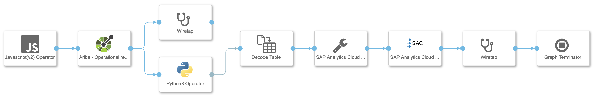
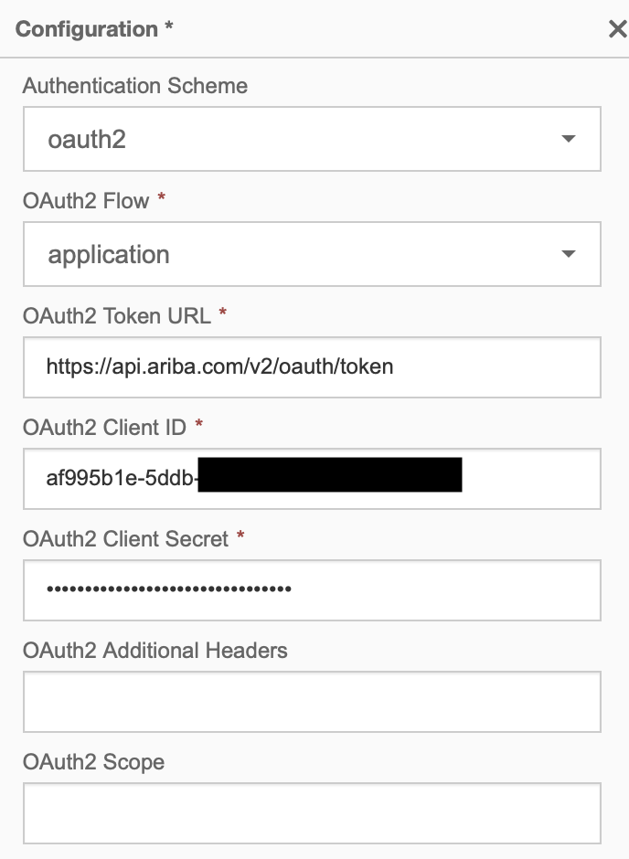
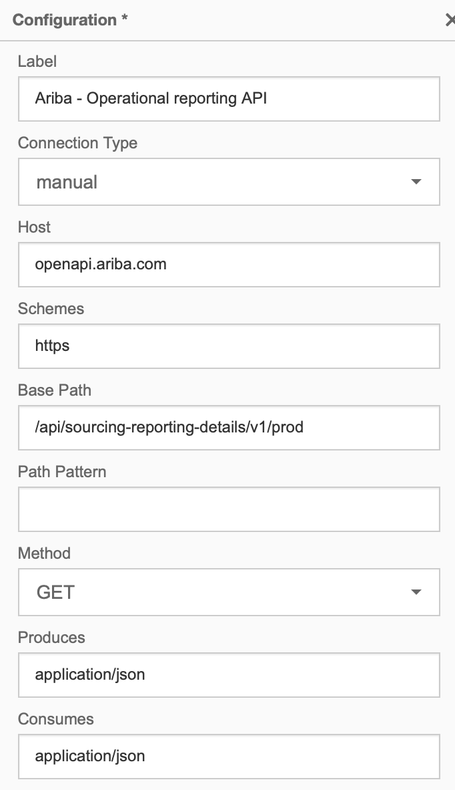
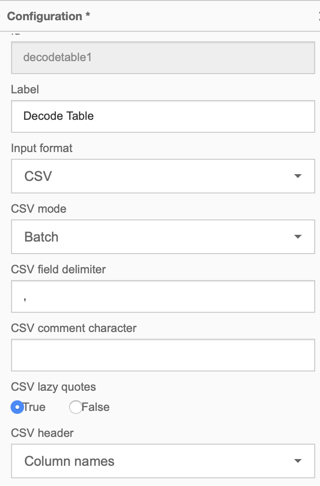
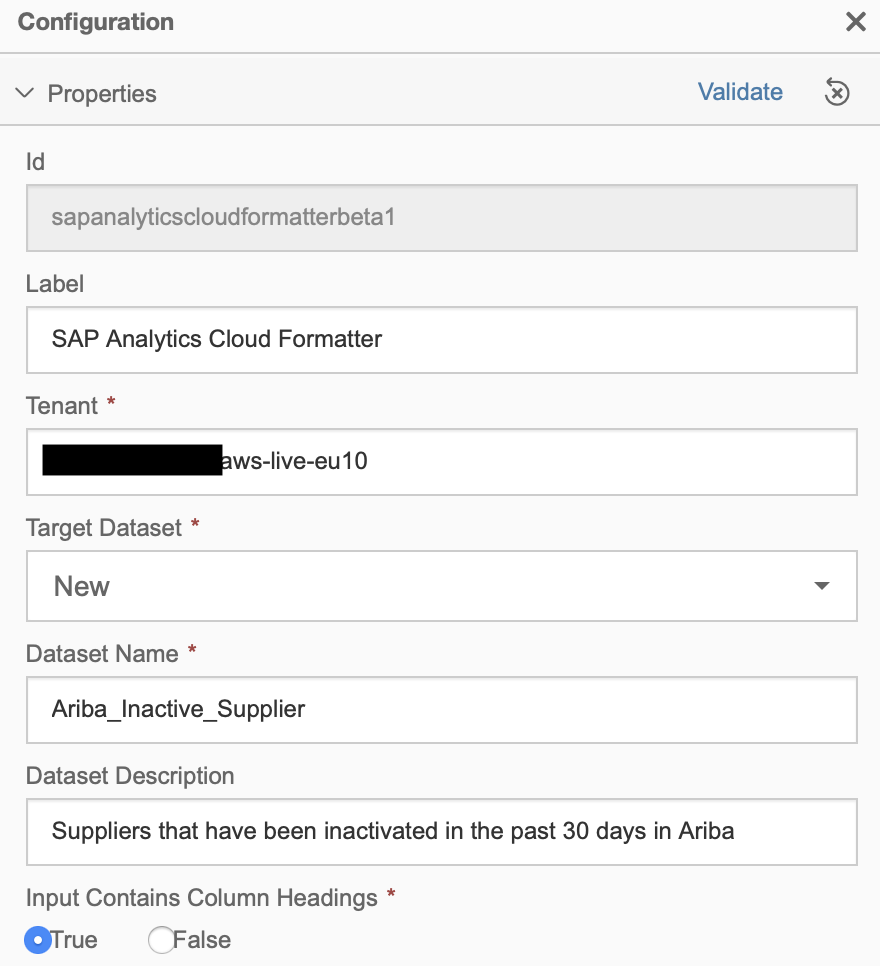
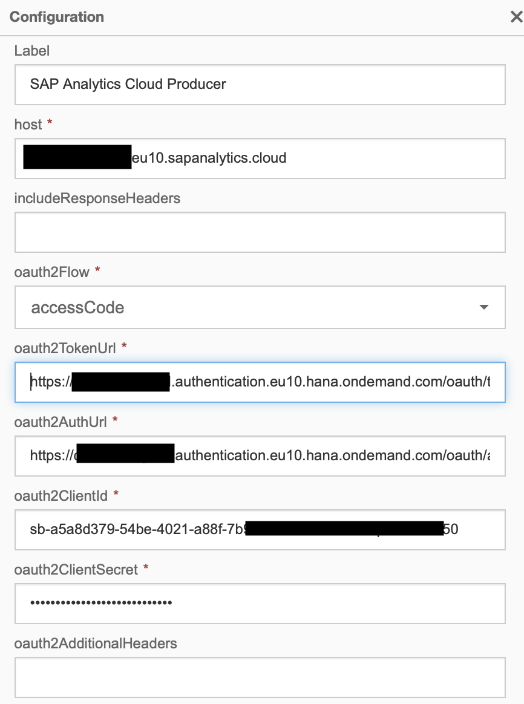
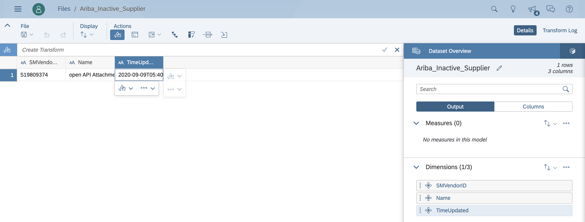

# Using SAP Data Intelligence to send reporting data from SAP Ariba to SAP Analytics Cloud

> This content was first published as a blog post - https://blogs.sap.com/2020/09/09/using-sap-data-intelligence-to-send-reporting-data-from-sap-ariba-to-sap-analytics-cloud/

In this exercise, we will cover how SAP Data Intelligence can be used to extract data from the SAP Ariba APIs and populate a dataset in SAP Analytics Cloud. The goal is to extract the suppliers that have been set to inactive the past 30 days in SAP Ariba and save the results in a dataset in SAP Analytics Cloud.

To achieve sending data from SAP Ariba to SAP Analytics Cloud we will need a few things first:

- *Create application in SAP Ariba Developer Portal and request API access*. Unfortunately there is no trial version of SAP Ariba but I guess that if you are here, it is because your company uses SAP Ariba :-). To find out how to create an application and request API access in the SAP Ariba Developer Portal check out :point_right: [topics/apis/request-api-access](../../apis/request-api-access/).
    > If you prefer watching videos, you can watch the first two videos available in the SAP Ariba for Developers YouTube playlist ? https://www.youtube.com/playlist?list=PL6RpkC85SLQDXSLHrSPtu8wztzDs8kYPX. 
    
    In this exercise, we will consume the same API ([Operational reporting API for strategic sourcing](https://help.sap.com/viewer/c4f46b9331834a0b970f834c20c9c73b/cloud/en-US/4221ce7dbee24fab9c34adb66d837111.html).
- *Access to an SAP Data Intelligence instance*. It is possible to deploy a trial instance of SAP Data Intelligence in your favourite hyperscaler if you don’t have access to an instance. If you want to find out how, follow the [Instantiate and Explorer SAP Data Intelligence tutorial](https://developers.sap.com/tutorials/dataintelligence-trial-v2-setup.html) available at https://developers.sap.com.
- *Access to an SAP Analytics Cloud*. SAP Analytics Cloud offers a free trial. Go ahead and create a trial account if you don’t have access to an SAP Analytics Cloud instance. Also, an OAuth 2.0 client in SAP Analytics Cloud is required. Details on how to create an OAuth 2.0 client in SAP Analytics Cloud, required for SAP Data Intelligence, can be found in this [[blog post](https://blogs.sap.com/2019/12/05/data-intelligence-integration-with-sap-analytics-cloud/)] by [[Ian Henry](https://people.sap.com/ian.henry)]

Now that we have access to the different systems, we will proceed to explain how to get SAP Data Intelligence talking with SAP Ariba and SAP Analytics Cloud.

We will build a pipeline in SAP Data Intelligence whose goal is to extract inactive suppliers in SAP Ariba and update a dataset in SAP Analytics Cloud. To accomplish this we will do the following:

1. Set up a [[Javascript operator](https://help.sap.com/viewer/97fce0b6d93e490fadec7e7021e9016e/Cloud/en-US/a59151380fdc461e97cdb66c7d360ff0.html)] to set attributes required by the OpenAPI client operator.
2. Authenticate and retrieving reporting data from the Operation reporting API for strategic sourcing using the [[OpenAPI client operator](https://help.sap.com/viewer/97fce0b6d93e490fadec7e7021e9016e/Cloud/en-US/8a70738566e6466eb8d0f7d68be80247.html)].
3. Use the [[Python3 operator](https://help.sap.com/viewer/97fce0b6d93e490fadec7e7021e9016e/Cloud/en-US/021180336add475bbd712b0ce5d393c1.html)] to do some data manipulation as the API response returns active and inactive suppliers as we are only interested in reporting inactive suppliers.
4. Use the [[Decode Table operator](https://help.sap.com/viewer/97fce0b6d93e490fadec7e7021e9016e/Cloud/en-US/1bb16c01874b4b2c9916c323d758f74f.html)] to convert the CSV output from the Python3 operator. This is required to send the data to SAP Analytics Cloud.
5. Configure the [[SAP Analytics Cloud formatter](https://help.sap.com/viewer/97fce0b6d93e490fadec7e7021e9016e/Cloud/en-US/773374a47ec84498a9621d0122d83ceb.html)] and [[producer](https://help.sap.com/viewer/97fce0b6d93e490fadec7e7021e9016e/Cloud/en-US/e4d7cf660a554e538ccdd920ad514708.html)] with our tenant details.
The pipeline end result is shown in the figure below.

|  |
|:--:|
| SAP Data Intelligence pipeline |

## Step 1 – Set up Javascript operator
As some API specific parameters (header, query parameters) are not possible to set via the OpenAPI client operator UI, we will need to set them up via code using the Javascript operator. The code snippet below shows the different parameters that we need to set up for the OpenAPI client operator. Example of header and query parameters set in the Javascript operator:

- Headers:
  - apiKey: The SAP Ariba Application ID is required in our API request.
- Query:
  - realm: SAP Ariba realm code.
  - includeInactive: The API response will include inactive objects.
  - filters: The date filters are dynamic, so that the request only retrieves the suppliers from the past day.

See the [ariba-api-parameters.js](ariba-api-parameters.js) script

## Step 2 – Configure the OpenAPI client operator
In the OpenAPI client operator we configure 2 things:

- OAuth 2.0 credentials
- Operational reporting API details: It is not possible to specify dynamically all parameters, e.g. filters, hence why the code in Step 1 is required.

|  |
|:--:|
| SAP Ariba OAuth 2.0 authentication details

Ariba API configuration:

|  |
|:--:|
| SAP Ariba Operational Reporting API configuration |
 

## Step 3 – Data manipulation in the Python3 operator

The Python3 operator will be responsible of processing the OpenAPI client response. It will remove the active suppliers that might be included in the response and outputs only inactive suppliers. For simplicity reasons, the Python3 operator will output a string containing the inactive suppliers in CSV format.

See the Python3 operator code in [data-manipulation.py](data-manipulation.py)

## Step 4 – Convert CSV to Table

The Decode table operator converts the Python3 operator output string, in CSV format, and converts it into a table. This table is what the SAP Analytics Cloud producer expects to create/replace/append to a dataset in SAP Analytics Cloud.

Configuration:

|  |
|:--:|
| Decode Table operator configuration |

Step 5 – Configure the SAP Analytics Cloud components
We now proceed to configure the dataset details in the SAP Analytics Cloud formatter operator. Note that in the configuration below we set the Target Dataset field as New…. after running the pipeline for the first time we can set it to Replace so that every time the pipeline runs, it will replace the dataset in SAP Analytics Cloud. We copy the dataset ID from the dataset created and set the Target Dataset option to replace and specify the dataset ID.

|  |
|:--:|
| SAP Analytics Cloud formatter configuration |

All we are missing now is the SAP Analytics Cloud producer OAuth 2.0 details and we are ready to run the pipeline.

|  |
|:--:|
| SAP Analytics Cloud producer configuration |

Now that all steps are completed, we run the SAP Data Intelligence pipeline and check the results in SAP Analytics Cloud.

|  |
|:--:|
| SAP Analytics Cloud Ariba_Inactive_Suppliers dataset |

As we can see, we have created a dataset containing only inactive suppliers in SAP Analytics Cloud. We can now use this dataset to create a report/dashboard in SAP Analytics Cloud.